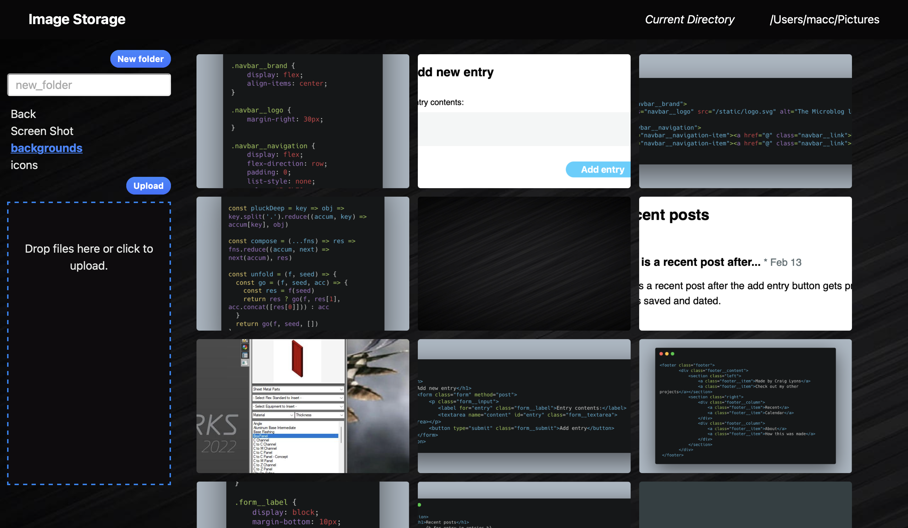
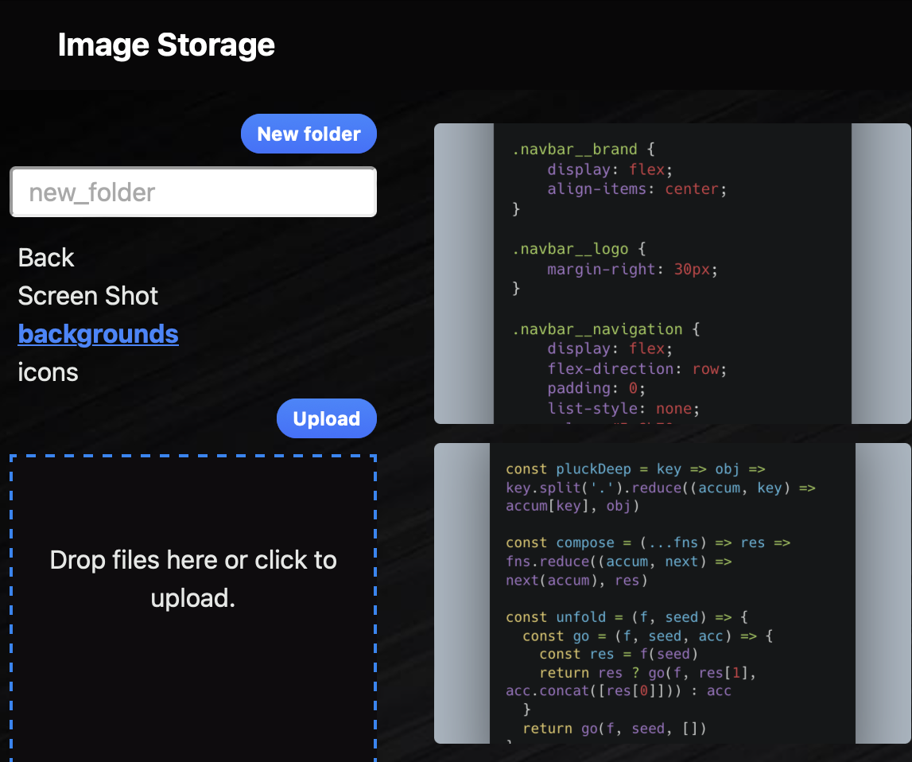

# Image Server Manager

This program was created to run on a local server so that my wife has a place to store and back up her images locally. With a drag and drop web page, she can easily upload images without having to get out and plug in a hard drive.

### Folder menu
Folders are pulled in from the computer or server that the flask website is running on. gunicorn is used for deplyment on my linux server.

